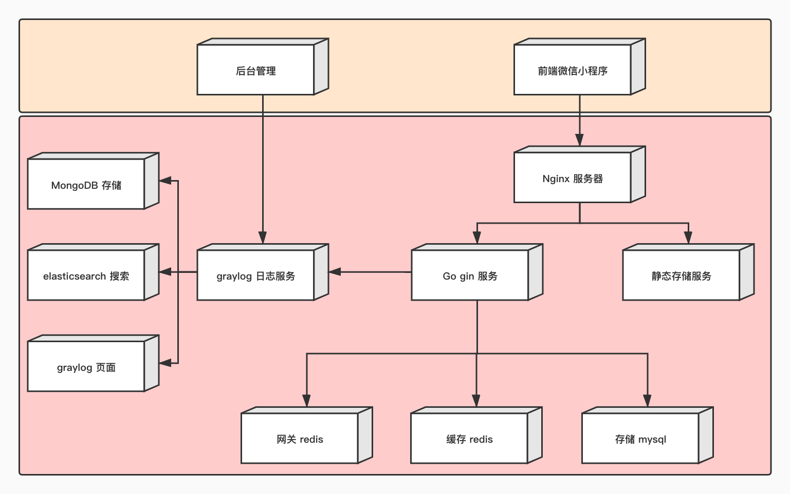
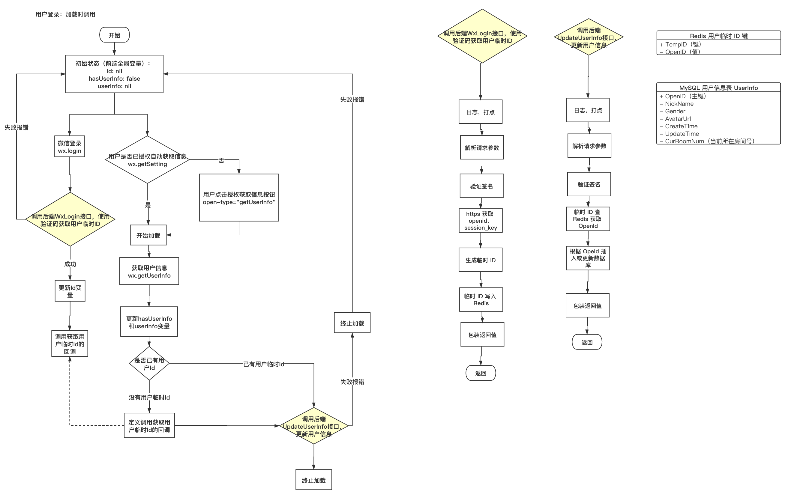
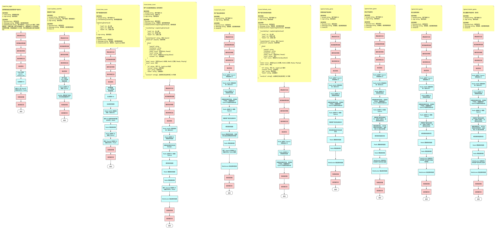
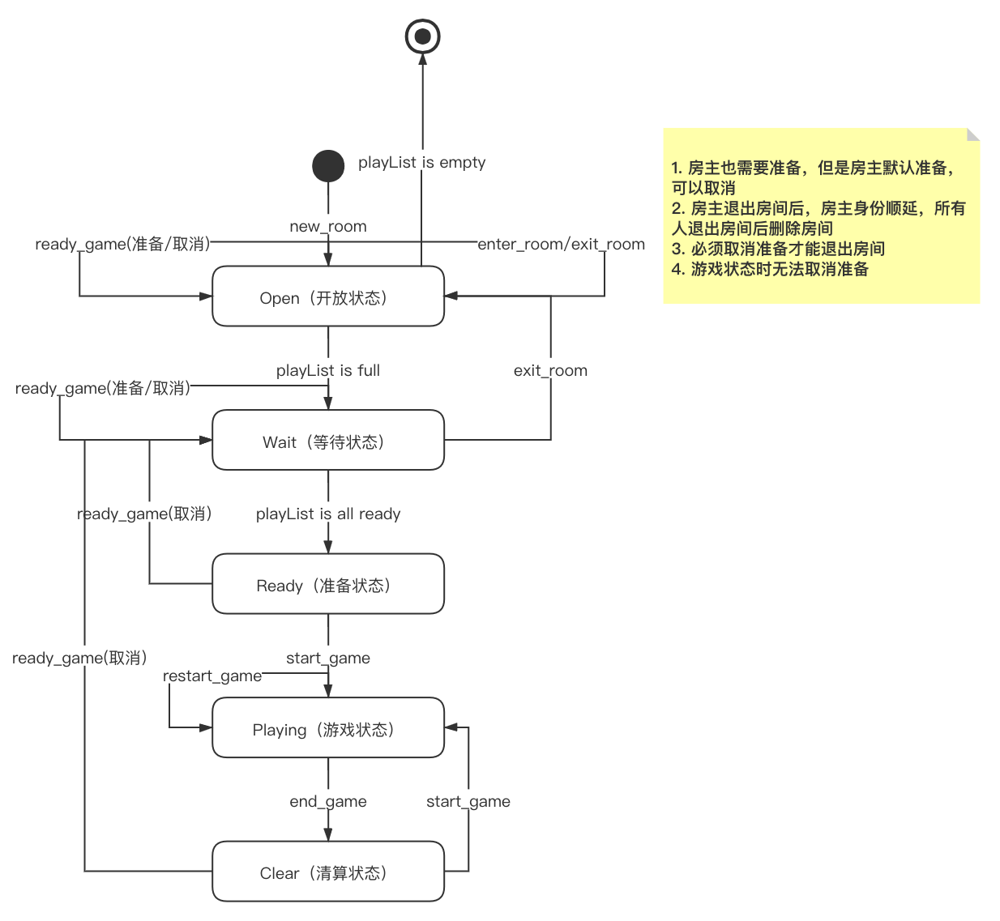

# GoWxWhoIsSpy

敏感数据已用`something`脱敏。

---

# 部署



# 分层设计

- 中间件层：
    - 日志中间层
        1. 生成 logid
        2. 访问日志
        3. 耗时日志
    - 网关中间层
        1. 请求方法唯一标识，判断接收或拒绝服务
        2. 请求唯一标识，防重入
        3. 解析请求参数
        4. 验证签名
    - 限流中间层
        - 判断是否限流
- Handler 层
    - 解析参数
    - 转发请求
    - 包装返回值
- Service 层
    - 实际处理请求（处理完毕后打开重入锁）
- Model/Dao 层
    - Mysql
    - Redis

---

# 错误报告

- 启动错误报告可以只 panic，不打日志
- 运行错误 panic 需要搭配 fatal 日志，通知提供邮件报警

---

# 详细设计

## 接口设计

- 接口详细设计（初步）



- 接口设计（初步）



## 模型设计

### 用户信息（Type：User）：

```go
type User struct {
 ID         int64     `json:"id" gorm:"column:id"`                   // 自增ID
 OpenId     string    `json:"openid" gorm:"column:openid"`           // openid，和微信接口的字段名一致
 NickName   string    `json:"nickName" gorm:"column:nick_name"`      // 用户昵称
 Gender     int       `json:"gender" gorm:"column:gender"`           // 用户性别
 AvatarUrl  string    `json:"avatarUrl" gorm:"column:avatar_url"`    // 用户头像
 City       string    `json:"city" gorm:"column:city"`               // 用户城市
 Province   string    `json:"province" gorm:"column:province"`       // 用户省份
 Country    string    `json:"country" gorm:"column:country"`         // 用户国家
 Language   string    `json:"language" gorm:"column:language"`       // 用户语言
 CreateTime time.Time `json:"create_time" gorm:"column:create_time"` // 创建时间
 UpdateTime time.Time `json:"update_time" gorm:"column:update_time"` // 更新时间
}
```

### 词汇信息（Type：Word）：

```go
type Word struct {
 ID         int    `gorm:"column:id"`          // 自增ID
 NormalWord string `gorm:"column:normal_word"` // 平民词汇，平民可以没有词（白板），即只有卧底有词
 SpyWord    string `gorm:"column:spy_word"`    // 卧底词汇
 BlankWord  string `gorm:"column:blank_word"`  // 空白词汇，白板一定没有词，可以是类别提示
 Class      string `gorm:"column:class"`       // 词汇类别
}
```

### 房间信息（Type：RoomInfo）：

```go
// 房间人数配置
type RoomSetting struct {
	TotalNum int `json:"total_num"` // 总人数
	SpyNum   int `json:"spy_num"`   // 卧底人数
	BlankNum int `json:"blank_num"` // 白板人数
}

// 玩家信息
type Player struct {
	OpenId    string      `json:"open_id"`    // openId
	NickName  string      `json:"nick_name"`  // 玩家用户名
	AvatarUrl string      `json:"avatar_url"` // 玩家头像
	State     PlayerState `json:"state"`      // 玩家状态
	Word      string      `json:"word"`       // 玩家本轮词汇
	Role      PlayerRole  `json:"role"`       // 玩家本轮角色
	IsSelf    bool        `json:"is_self"`    // 是否是玩家本人
}

// 房间信息
type RoomInfo struct {
	RoomId       string    `json:"room_id"`        // 房间 Id
	*RoomSetting `json:"room_setting"`             // 房间配置信息
	MasterOpenId string    `json:"master_open_id"` // 房主 openId
	IsMaster     bool      `json:"is_master"`      // 是否是房主本人
	PlayerList   []*Player `json:"player_list"`    // 玩家信息列表
	State        RoomState `json:"state"`          // 房间状态
	*Word        `json:"word"`                     // 房间本轮词汇
	BeginPlayer  string    `json:"begin_player"`   // 第一个玩家本轮用户名（第一个玩家一定不为白板，且词不为空）
	//TODO：WordSet      iset.Set  `json:"word_set"`       // 房间之前词汇集合（确保同一房间的词汇不重复），暂时不用，不进行重复词汇校检
	WordCache []*Word `json:"word_cache"` // 房间缓存词汇（每次获取词汇列表，之后从缓存中获取本轮词汇）
}
```

---

## 接口设计

### 请求值和返回值

#### request：

```go
req: {
    "data": type string,    // 请求数据（请求数据的格式为 map[string]string 的 json 化）
    "sign": type string,    // 请求签名
}
```

#### response

```go
resp: {
	"Success":  type bool,          // 返回是否成功
	"Message":  type string,        // 返回信息（错误信息或成功信息）
    "Data":     type interface{},   // 返回数据（接口类型）（返回数据类型为 map[string]string 的 json 化 或 基本数据类型的 json 化）
    "LogId"     type string,        // 请求日志 ID
}
```

### 用户接口

#### 用户登录（user/wx_login）

##### reqData

```go
"data": {
    "code": type string,    // 微信登录码
}
```

##### respData

```go
"data"(tempId): type string,    // 用户临时登录 ID
```

##### 特殊错误

|错误 Message|错误类型|错误处理|
|---|---|---|
|Duplicate|请求重复|提示用户请勿过快点击|
|Overload|服务器超载|提示用户服务器火爆中|
|其他错误|失败|重新调用该接口或提示用户出现错误|

##### 示例请求

```go
reqDataJsonString: {"code":"test_code"}
respData: {"Data":"202103051014402624619DFD","LogId":"20210305101440249857059A","Message":"Success","Success":true}
```

#### 更新用户信息（user/update_userInfo）

##### reqData

```go
"data": {
    "tempId": type string,      // 用户临时登录 ID
    "userInfo": type User,      // 用户信息
}
```

##### respData

```go
"data"(nil)
```

##### 特殊错误

|错误 Message|错误类型|错误处理|
|---|---|---|
|UserNotLogin|用户未登录|提示用户登录信息已过期，重新调用登录接口|
|Duplicate|请求重复|提示用户请勿过快点击|
|Overload|服务器超载|提示用户服务器火爆中|
|其他错误|失败|重新调用该接口或提示用户出现错误|

##### 示例请求

```go
reqDataJsonString: {"tempId":"20210303140727681706115F","userInfo":"{\"id\":0,\"openid\":\"\",\"nickName\":\"test_nick_name\",\"gender\":0,\"avatarUrl\":\"\",\"city\":\"\",\"province\":\"\",\"country\":\"\",\"language\":\"\",\"create_time\":\"0001-01-01T00:00:00Z\",\"update_time\":\"0001-01-01T00:00:00Z\"}"}
respData: {"Data":null,"LogId":"202103051018189966030F21","Message":"UserNotLogin","Success":false}
```

---

### 房间接口

#### 创建房间（room/new_room）

##### reqData

```go
"data": {
    "tempId": type string,              // 用户临时登录 ID
    "roomSetting": type RoomSetting,    // 房间配置信息
}
```

##### respData

```go
"data"(roomInfo): type RoomInfo     // 房间信息
```

##### 特殊错误

|错误 Message|错误类型|错误处理|
|---|---|---|
|UserNotLogin|用户未登录|提示用户登录信息已过期，重新调用登录接口|
|Duplicate|请求重复|提示用户请勿过快点击|
|Overload|服务器超载|提示用户服务器火爆中|
|其他错误|失败|重新调用该接口或提示用户出现错误|

- 房间配置校检应在前后端共同执行，后端校检逻辑为：

```go
	if roomSetting.TotalNum < 3 || // 总人数应该大于 3
		roomSetting.SpyNum < 1 || // 卧底人数应该大于 1
		roomSetting.BlankNum < 0 || // 白板人数应该不小于 0
		roomSetting.TotalNum <= roomSetting.SpyNum+roomSetting.BlankNum { // 平民人数应该大于 0
```

##### 示例请求

```go
reqDataJsonString: {"roomSetting":"{\"total_num\":6,\"spy_num\":2,\"blank_num\":0}","tempId":"2021030510252566860A347"}
respData: {"Data":{"roomId":"202103051025258212416CE5","roomInfo":{"begin_player":"","master_open_id":"202103051025256500318C7","player_list":[{"avatar_url":"test_url","nick_name":"test_nick_name","open_id":"202103051025256500318C7","role":"","state":"Wait","word":""}],"room_id":"202103051025258212416CE5","room_setting":{"blank_num":0,"spy_num":2,"total_num":6},"state":"Open","word":{"BlankWord":"","Class":"","ID":0,"NormalWord":"","SpyWord":""},"word_cache":[]}},"LogId":"202103051025258009739449","Message":"Success","Success":true}
```

#### 加入房间（room/enter_room）

##### reqData

```go
"data": {
    "tempId": type string,  // 用户临时登录 ID
    "roomId": type string,  // 房间 ID
}
```

##### respData

```go
"data"(roomInfo): type RoomInfo     // 房间信息
```

##### 特殊错误

|错误 Message|错误类型|错误处理|
|---|---|---|
|UserNotLogin|用户未登录|提示用户登录信息已过期，重新调用登录接口|
|RoomInvalid|房间无效|提示用户房间已不存在，并退出房间|
|Duplicate|请求重复|提示用户请勿过快点击|
|Overload|服务器超载|提示用户服务器火爆中|
|其他错误|失败|重新调用该接口或提示用户出现错误|

##### 示例请求

```go
reqDataJsonString: {"roomId":"202103051025258212416CE5","tempId":"202103051025252503923BCB"}
respData: {"Data":null,"LogId":"20210305102525838506EDB6","Message":"Success","Success":true}
```

#### 退出房间（room/exit_room）

##### reqData

```go
"data": {
    "tempId": type string,  // 用户临时登录 ID
}
```

##### respData

```go
"data"(nil)
```

##### 特殊错误

|错误 Message|错误类型|错误处理|
|---|---|---|
|UserNotLogin|用户未登录|提示用户登录信息已过期，重新调用登录接口|
|RoomInvalid|房间无效|提示用户房间已不存在，并退出房间|
|Duplicate|请求重复|提示用户请勿过快点击|
|Overload|服务器超载|提示用户服务器火爆中|
|其他错误|失败|重新调用该接口或提示用户出现错误|

##### 示例请求

```go
reqDataJsonString: {"tempId":"202103051025252503923BCB"}
respData: {"Data":null,"LogId":"20210305102525838506EDB6","Message":"Success","Success":true}
```

#### 获取房间信息（room/refresh_room）

##### reqData

```go
"data": {
    "tempId": type string,  // 用户临时登录 ID
}
```

##### respData

```go
"data"(roomInfo): type RoomInfo     // 房间信息
```

##### 特殊错误

|错误 Message|错误类型|错误处理|
|---|---|---|
|UserNotLogin|用户未登录|提示用户登录信息已过期，重新调用登录接口|
|RoomInvalid|房间无效|提示用户房间已不存在，并退出房间|
|Duplicate|请求重复|提示用户请勿过快点击|
|Overload|服务器超载|提示用户服务器火爆中|
|其他错误|失败|重新调用该接口或提示用户出现错误|

##### 示例请求

```go
reqDataJsonString: {"tempId":"20210305102943283813F4CC"}
respData: {"Data":{"roomInfo":{"begin_player":"","master_open_id":"2021030510294328209643FF","player_list":[{"avatar_url":"test_url","nick_name":"test_nick_name","open_id":"2021030510294328209643FF","role":"","state":"Wait","word":""}],"room_id":"20210305102943424306C45E","room_setting":{"blank_num":0,"spy_num":2,"total_num":6},"state":"Open","word":{"BlankWord":"","Class":"","ID":0,"NormalWord":"","SpyWord":""},"word_cache":[]}},"LogId":"20210305102943439571C093","Message":"Success","Success":true}
```

完整的房间信息为：

```go
{"room_id":"202103051127283138524E98","room_setting":{"total_num":10,"spy_num":2,"blank_num":0},"master_open_id":"2021030511272763382238B6","player_list":[{"open_id":"2021030511272763382238B6","nick_name":"test_nick_name","avatar_url":"test_url","state":"Ready","word":"筷子","role":"Normal"},{"open_id":"20210305112727759254B836","nick_name":"test_nick_name","avatar_url":"test_url","state":"Ready","word":"筷子","role":"Normal"},{"open_id":"20210305112728141226D4B5","nick_name":"test_nick_name","avatar_url":"test_url","state":"Ready","word":"筷子","role":"Normal"},{"open_id":"2021030511272798888152E0","nick_name":"test_nick_name","avatar_url":"test_url","state":"Ready","word":"筷子","role":"Normal"},{"open_id":"20210305112727871421AAD2","nick_name":"test_nick_name","avatar_url":"test_url","state":"Ready","word":"筷子","role":"Normal"},{"open_id":"20210305112727930913640B","nick_name":"test_nick_name","avatar_url":"test_url","state":"Ready","word":"牙签","role":"Spy"},{"open_id":"2021030511272850947BC4C","nick_name":"test_nick_name","avatar_url":"test_url","state":"Ready","word":"筷子","role":"Normal"},{"open_id":"202103051127278136907FF3","nick_name":"test_nick_name","avatar_url":"test_url","state":"Ready","word":"牙签","role":"Spy"},{"open_id":"20210305112727704316C846","nick_name":"test_nick_name","avatar_url":"test_url","state":"Ready","word":"筷子","role":"Normal"},{"open_id":"20210305112728224665A96A","nick_name":"test_nick_name","avatar_url":"test_url","state":"Ready","word":"筷子","role":"Normal"}],"state":"Playing","word":{"ID":3,"NormalWord":"筷子","SpyWord":"牙签","BlankWord":"","Class":"NotYet"},"begin_player":"test_nick_name","word_cache":[{"ID":2,"NormalWord":"浴缸","SpyWord":"鱼缸","BlankWord":"","Class":"NotYet"},{"ID":5,"NormalWord":"眉毛","SpyWord":"睫毛","BlankWord":"","Class":"NotYet"},{"ID":1,"NormalWord":"内裤","SpyWord":"内衣","BlankWord":"","Class":"NotYet"},{"ID":4,"NormalWord":"饺子","SpyWord":"包子","BlankWord":"","Class":"NotYet"}]}
```

---

### 游戏接口

#### 准备游戏（game/ready_game）

##### reqData

```go
"data": {
    "tempId": type string,  // 用户临时登录 ID
}
```

##### respData

```go
"data"(nil)
```

##### 特殊错误

|错误 Message|错误类型|错误处理|
|---|---|---|
|UserNotLogin|用户未登录|提示用户登录信息已过期，重新调用登录接口|
|RoomInvalid|房间无效|提示用户房间已不存在，并退出房间|
|Duplicate|请求重复|提示用户请勿过快点击|
|Overload|服务器超载|提示用户服务器火爆中|
|其他错误|失败|重新调用该接口或提示用户出现错误|

##### 示例请求

```go
reqDataJsonString: {"tempId":"202103051025252503923BCB"}
respData: {"Data":null,"LogId":"20210305102525838506EDB6","Message":"Success","Success":true}
```

#### 开始游戏（game/start_game）

##### reqData

```go
"data": {
    "tempId": type string,  // 用户临时登录 ID
}
```

##### respData

```go
"data"(nil)
```

##### 特殊错误

|错误 Message|错误类型|错误处理|
|---|---|---|
|UserNotLogin|用户未登录|提示用户登录信息已过期，重新调用登录接口|
|RoomInvalid|房间无效|提示用户房间已不存在，并退出房间|
|Duplicate|请求重复|提示用户请勿过快点击|
|Overload|服务器超载|提示用户服务器火爆中|
|其他错误|失败|重新调用该接口或提示用户出现错误|

##### 示例请求

```go
reqDataJsonString: {"tempId":"202103051025252503923BCB"}
respData: {"Data":null,"LogId":"20210305102525838506EDB6","Message":"Success","Success":true}
```

#### 结束游戏（game/end_game）

##### reqData

```go
"data": {
    "tempId": type string,  // 用户临时登录 ID
}
```

##### respData

```go
"data"(nil)
```

##### 特殊错误

|错误 Message|错误类型|错误处理|
|---|---|---|
|UserNotLogin|用户未登录|提示用户登录信息已过期，重新调用登录接口|
|RoomInvalid|房间无效|提示用户房间已不存在，并退出房间|
|Duplicate|请求重复|提示用户请勿过快点击|
|Overload|服务器超载|提示用户服务器火爆中|
|其他错误|失败|重新调用该接口或提示用户出现错误|

##### 示例请求

```go
reqDataJsonString: {"tempId":"202103051025252503923BCB"}
respData: {"Data":null,"LogId":"20210305102525838506EDB6","Message":"Success","Success":true}
```
#### 重新开始游戏（game/restart_game）

##### reqData

```go
"data": {
    "tempId": type string,  // 用户临时登录 ID
}
```

##### respData

```go
"data"(nil)
```

##### 特殊错误

|错误 Message|错误类型|错误处理|
|---|---|---|
|UserNotLogin|用户未登录|提示用户登录信息已过期，重新调用登录接口|
|RoomInvalid|房间无效|提示用户房间已不存在，并退出房间|
|Duplicate|请求重复|提示用户请勿过快点击|
|Overload|服务器超载|提示用户服务器火爆中|
|其他错误|失败|重新调用该接口或提示用户出现错误|

##### 示例请求

```go
reqDataJsonString: {"tempId":"202103051025252503923BCB"}
respData: {"Data":null,"LogId":"20210305102525838506EDB6","Message":"Success","Success":true}
```

---

## 服务流程设计

### 状态机设计




